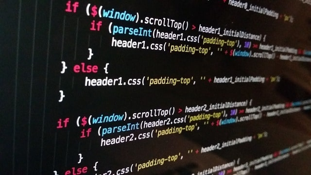

<!-- TOP IMG -->
<!---->

<!--WELCOME-->
<h1 align='center'>Hi 👋, I'm Josh Holtz</h1>

<a href="http://www.jholtz.co.uk">
     <!--OR PORTFOLIO ICON: https://img.shields.io/badge/Portfolio-255E63?style=for-the-badge&logo=About.me&logoColor=white -->
</a>

<h3 align='center'>A Web Development & Cyber Security Student</h3>    

<!--ABOUT-->

  

    Hi I'm Josh Holtz, a thrid-year student studying @ the University of Northampton, enrolled on Web Development and Cyber Security. I’m committed to gaining hands-on experience and enhancing my skills to embrace in the dynamic world of technology and security.
  

  

  - 🌱 I’m currently learning React Native 
  - 📫 How to reach me: <a href="http://www.jholtz.co.uk" target="_blank">jholtz.co.uk</a> 
  - 👯 I’m looking to collaborate on most things Web Dev

  

<!-- CODE LANGS -->

<h3>My Languages & Tools: </h3>

 
 
 

 
 
 
 

 

 
 
 

<!--
<h3 align="left">Connect with me:</h3>

-->

<!--
**JoshHoltz/JoshHoltz** is a ✨ _special_ ✨ repository because its `README.md` (this file) appears on your GitHub profile.

Here are some ideas to get you started:

- 🔭 I’m currently working on ...
- 🌱 I’m currently learning ...
- 👯 I’m looking to collaborate on ...
- 🤔 I’m looking for help with ...
- 💬 Ask me about ...
- 📫 How to reach me: ...
- 😄 Pronouns: ...
- ⚡ Fun fact: ...
-->
